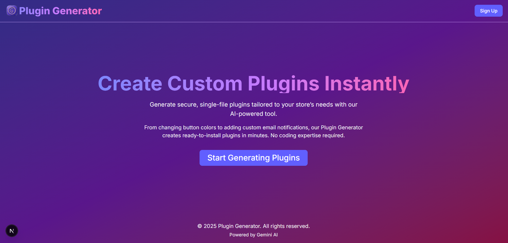
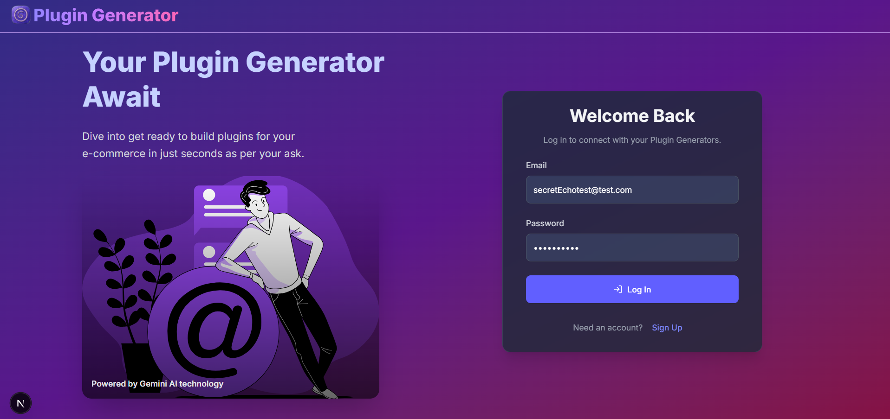
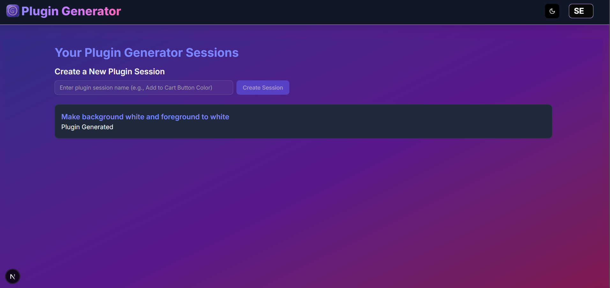
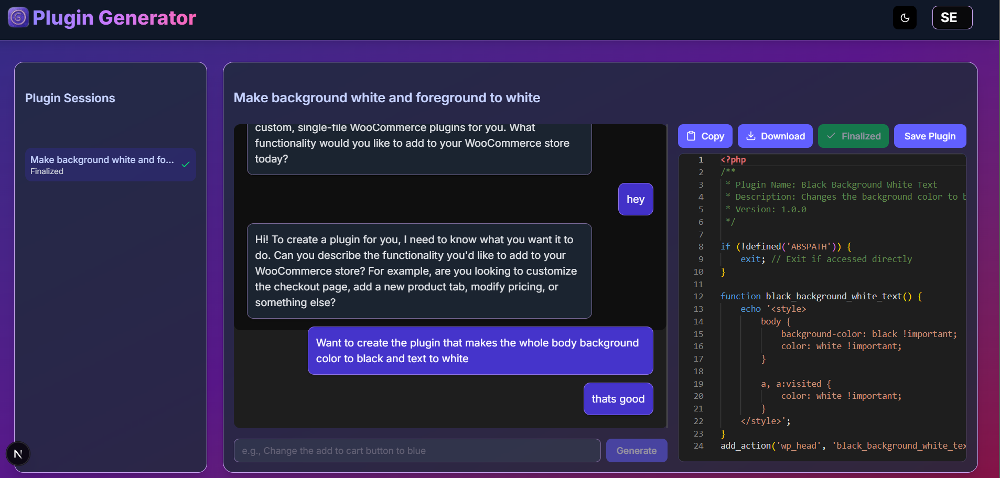

# SecretEcho Plugin Generator Frontend: LLM-Powered WooCommerce Plugin Generator

## Overview

**SecretEcho Frontend** is a web-based application designed to assist eCommerce merchants in generating custom single-file WooCommerce plugins using an LLM (Large Language Model) agent.

Its built with **Next.js**, **Monaco Editor** (for the code editor), **Shadcn** (for the component library), **Framer motion** (for the animation), **Prismjs**, **React TanStack Query** (for state management), and **WebSocket** (for real-time communication with the LLM agent). It includes features like plugin session management, a chat interface for merchant requests, and a code editor for viewing and managing generated plugins. The project also supports Docker for local development and production deployment.

### Features

- **Landing Page**: A welcoming page introducing the plugin generator service.
- **Authentication**: Secure user authentication (assumed feature for production use).
- **Dashboard**: Overview of plugin sessions and quick access to the plugin generator.
- **Chat Interface**: Allows merchants to send requests to the LLM and view responses.
- **Plugin Generator Editor**: A VS Code-like editor to view, copy, download, and finalize generated plugins.
- **Docker Support**: Run the app locally or in production using Docker.
- **Deploymeent on Railway with Docker Support**: Deployed the final build on Railway.app using Docker.
- **Local Testing**: Plugins tested with Local (<https://localwp.com/>) on a WordPress/WooCommerce site.

## Screenshots

Below are placeholders for screenshots of the application. (Replace these with actual images.)

- **Landing Page**
  
  

*The landing page welcomes users and provides an overview of the plugin generator service.*

- **Authentication**
  
 
 
  *The authentication page allows users to log in securely (assumed feature).*

- **Dashboard**
  
  

*The dashboard displays plugin sessions and provides quick access to the plugin generator.*

- **Chat Interface and Plugin Generator Editor**
  


  *The chat interface (left) for merchant requests and the code editor (right) for viewing generated plugins.*

## Prerequisites

- **Node.js**: Version 18.x or higher.
- **Docker**: For running the app in containers.
- **Docker Compose**: For local development.
- **Local (Optional)**: For testing plugins on a local WordPress/WooCommerce site (<https://localwp.com/>).

## File Structure

```
secretecho-frontend/
├── Dockerfile              # Dockerfile for building the app (dev and prod stages)
├── docker-compose.yaml     # Docker Compose for local development
├── public/                 # Static assets (e.g., images, favicon)
├── src/
│   ├── components/         # Reusable React components
│   │   ├── ui/             # UI components (e.g., Button, Card, Input from shadcn)
│   │   ├── PluginGeneratorEditor.tsx # Main plugin generator component
│   ├── config/             # Configuration files (e.g., axios setup)
│   │   ├── axios.ts        # Axios configuration for API requests
│   ├── context/            # React context for state management
│   │   ├── webSocketContext.tsx # WebSocket context for LLM communication
│   ├── hooks/              # Custom React hooks
│   │   ├── useChatHistory.ts # Hook for managing chat history
│   │   ├── useChatStore.ts   # Hook for managing chat input state
│   ├── providers/          # Providers for state management
│   │   ├── plugin_generator.tsx # React Query provider for plugin sessions
│   ├── types/              # TypeScript type definitions
│   │   ├── plugins.types.ts # Types for messages, WebSocket, etc.
│   ├── pages/              # Next.js pages (assumed structure)
│   │   ├── index.tsx       # Landing page
│   │   ├── auth.tsx        # Authentication page
│   │   ├── dashboard.tsx   # Dashboard page
│   │   ├── chat.tsx        # Chat and plugin generator page
├── package.json            # Project dependencies and scripts
├── README.md               # Project documentation
```

## Environment Variables

Create a `.env.local` file in the project root with the following variables:

```
APP_NAME={{APP_NAME}}
V1_API_ENDPOINT={{V1_API_ENDPOINT}}
NEXT_PUBLIC_FRONTEND_URL={{NEXT_PUBLIC_FRONTEND_URL}}
SESSION_COOKIE_NAME={{SESSION_COOKIE_NAME}}
SESSION_COOKIE_PASSWORD={SESSION_COOKIE_PASSWORD}
NEXT_PUBLIC_WEBSOCKET_URL={{NEXT_PUBLIC_WEBSOCKET_URL}}
```

For production deployment, set these variables in your hosting environment or Docker configuration.

## Setup and Installation

### Local Development (Without Docker)

1. Clone the repository:

   ```bash
   git clone <repository-url>
   cd secretecho-frontend
   ```

2. Install dependencies:

   ```bash
   npm install
   ```

3. Create a `.env.local` file with the environment variables above.
4. Start the development server:

   ```bash
   npm run dev
   ```

5. Open the app in your browser at `http://localhost:3000`.

### Local Development (With Docker)

1. Ensure Docker and Docker Compose are installed.
2. Build and start the containers:

   ```bash
   docker-compose up --build
   ```

3. Open the app in your browser at `http://localhost:3000`.
4. Make changes to the code, and the app will hot-reload automatically.
5. To stop the containers:

   ```bash
   docker-compose down
   ```

## Frontend Components and Functionality

### 1. Landing Page

- **Purpose**: Welcomes users to the SecretEcho plugin generator service.
- **Features**:
  - Displays a hero section with a call-to-action to get started.
  - Provides an overview of what the service offers (e.g., generating custom WooCommerce plugins).
  - Includes a "Sign Up" or "Log In" button to direct users to authentication.
- **Implementation**: Assumed to be a simple Next.js page with Tailwind CSS for styling.

### 2. Authentication Page

- **Purpose**: Handles user authentication (assumed feature for production use).
- **Features**:
  - Login form with email and password fields.
  - Option to sign up for new users.
  - Redirects authenticated users to the dashboard.
- **Implementation**: Assumed to use a library like `next-auth` for authentication, with a UI built using shadcn components (e.g., `Input`, `Button`).

### 3. Dashboard Page

- **Purpose**: Provides an overview of plugin sessions and quick access to the plugin generator.
- **Features**:
  - Displays a list of existing plugin sessions (similar to the sidebar in `PluginGeneratorEditor`).
  - Allows users to create a new plugin session.
  - Links to the chat/plugin generator page for each session.
- **Implementation**: Assumed to use React TanStack Query to fetch plugin sessions and shadcn components for the UI.

### 4. Chat and Plugin Generator Page

- **Purpose**: The core feature where merchants interact with the LLM to generate plugins.
- **Features**:
  - **Sidebar**: Lists all plugin sessions with their status (e.g., "Finalized" or "In Progress").
  - **Chat Panel**: Allows merchants to send requests (e.g., "Change the add to cart button to blue") and view LLM responses.
  - **Code Editor**: Displays the generated plugin code using Monaco Editor, with options to copy, download, finalize, and save the plugin.
  - **Real-Time Updates**: Uses WebSocket for real-time communication with the LLM agent.
  - **State Management**: Uses React TanStack Query (`useGetPluginGenerators`) for plugin sessions and custom hooks (`useChatHistory`, `useChatStore`) for chat state.
- **Implementation**:
  - Built in `PluginGeneratorEditor.tsx` with shadcn components (`Button`, `Card`, `Input`).
  - WebSocket integration via `useWebSocketContext` for real-time LLM communication.
  - Monaco Editor for displaying generated PHP code in a read-only mode.
  - Features like auto-scrolling in the chat panel and filtering out code messages from the chat (using the `type` field).

## Testing with Local (Bonus Task)

This project was tested using Local (<https://localwp.com/>) to run a WordPress/WooCommerce site locally and install generated plugins manually.

### Steps

1. **Set Up Local**:
   - Install Local from <https://localwp.com/>.
   - Create a new WordPress site (e.g., `WooCommercePluginTest`).
   - Install and activate WooCommerce via the WordPress admin dashboard.
2. **Generate a Plugin**:
   - Use the interface to generate a plugin (e.g., "Change the add to cart button to blue").
   - Download the plugin file (`custom-woocommerce-plugin.php`).
3. **Install the Plugin**:
   - In Local, copy the plugin file to `app/public/wp-content/plugins/`.
   - In the WordPress admin dashboard, go to **Plugins > Installed Plugins**, and activate the plugin.
4. **Test the Plugin**:
   - Visit the frontend (e.g., a product page) and verify the plugin works (e.g., the "Add to Cart" button turns blue).

**Note**: An automated installation feature using the WordPress REST API was attempted but deemed impractical for production deployment due to security concerns and the standard WordPress plugin installation workflow (manual upload). The manual installation process fulfills the bonus task requirements.

## Usage

1. Open the app (`http://localhost:3000` for local development).
2. (Assumed) Log in or sign up via the authentication page.
3. Navigate to the dashboard to create or select a plugin session.
4. On the chat page, send a request to the LLM agent (e.g., "Change the add to cart button to blue").
5. View the generated plugin in the code editor.
6. Download the plugin file and install it on your WooCommerce site.
7. Test the plugin on your site to confirm it works as expected.

## Future Improvements

- **Plugin Validation**: Add a validation step to ensure generated plugins are secure and compatible with WooCommerce.
- **Enhanced UI**: Add more interactive features to the dashboard and improve the chat interface with message history pagination.
